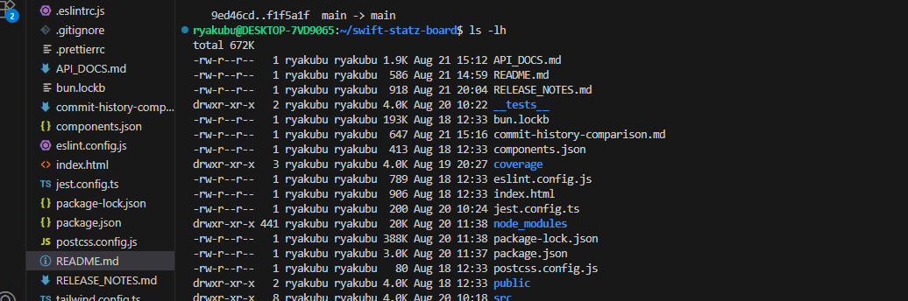

## Final Deliverables in Repository  
The following files were created and committed to the repo:  
- `README.md` → Project overview & setup guide.  
- `API_DOCS.md` → Detailed API documentation.  
- `commit-history-comparison.md` → Original vs improved commit messages.  
- `RELEASE_NOTES.md` → Release notes and changelog.  

📌 GitHub Repo: [swift-statz-board](https://github.com/ryakubu/swift-statz-board)
